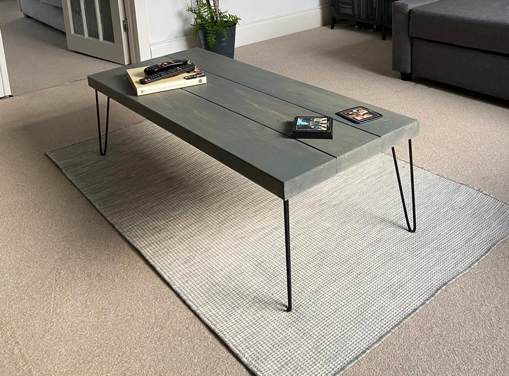

# Coffee Table

## Finished Piece

## Details

Build Date: Sept 19th 2020

Approx cost: Other than screws everything was spare.

Craftspeople:

- Alex Hedley
- Jon Hedley
- Philip Hay

## Materials

- 4x Hairpin Table Legs
- 3 pieces of wood
- Mini cross pieces (fence timber)
- Wax
- Grey paint
- Black spraypaint
- Screws

## Tools

- Evolution mitre saw
- Drill
- Screwdriver
- Sandpaper

## Photos

## Process

Cut the three main pieces of wood to the same size.

Screw supporting pieces between all three and a cross piece.

Sand down

Paint

Wax

Attach legs.
