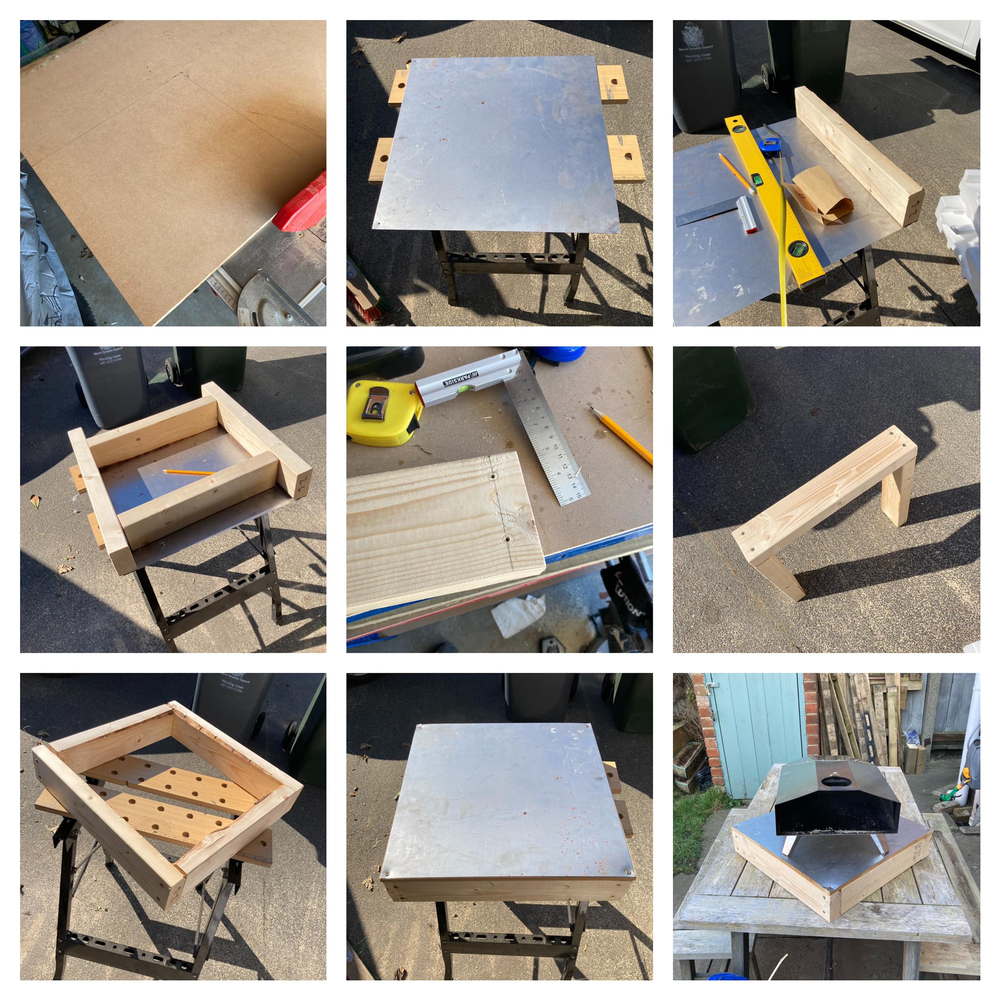

# Pizza Oven Table

## Finished Piece

## Details

Build Date: 26th March 2022

Approx cost: < £20?

Craftspeople:

- Alex Hedley

## Materials

- 2x4 - 2400mm
- mdf - 5mm 50mmx50mm
- Metal sheet - 1mm 50mmx50mm
  - £14 [eBay](https://www.ebay.co.uk/itm/Metal-Sheet-Plate-Mild-Steel-1mm-to-3mm-Thick-Guillotine-Cut-Plates-Sheets-UK-/224756581331?mkcid=16&mkevt=1&_trksid=p2349624.m46890.l49286&mkrid=710-127635-2958-0)
- screws

## Tools

- Evolution mitre saw
- table saw
- Drill

## Photos

## Process

Cut a sheet of mdf to 50mm x 50mm.

Drill a hole into each corner of the metal sheet.

Cut two pieces of 2x4 to 50mm each.

Cut two pieces of 2x4 to 40mm? each (diff in length to make square)

Measure half way from edge of end piece.

Drill pilot holes on each end.

Screw together.

Lay MDF on top, then sheet metal on top.

Screw into base.
